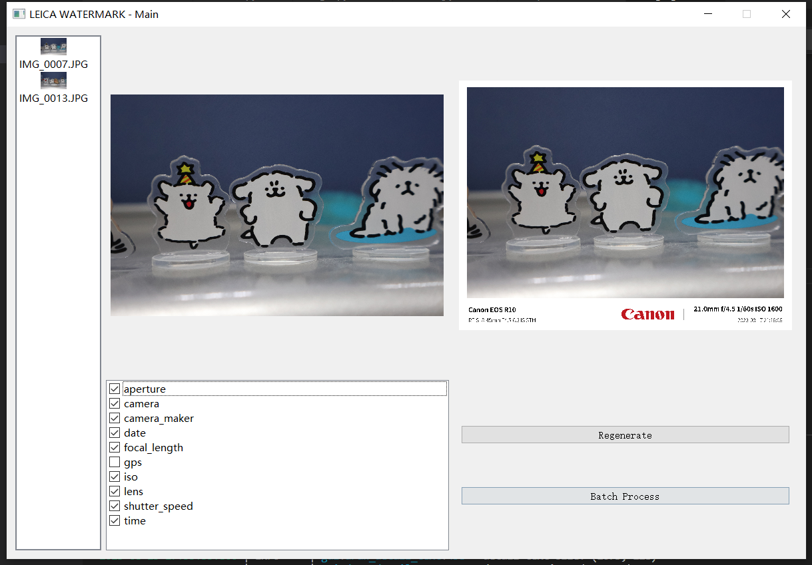

# LEICA-Watermark

## Demo


## How to run

```bash
pip install pipwin
pipwin install cairocffi
pip install -r requirements.txt
cd src
python main.py
```

## Reference

- [PyQt5](https://pypi.org/project/PyQt5/)